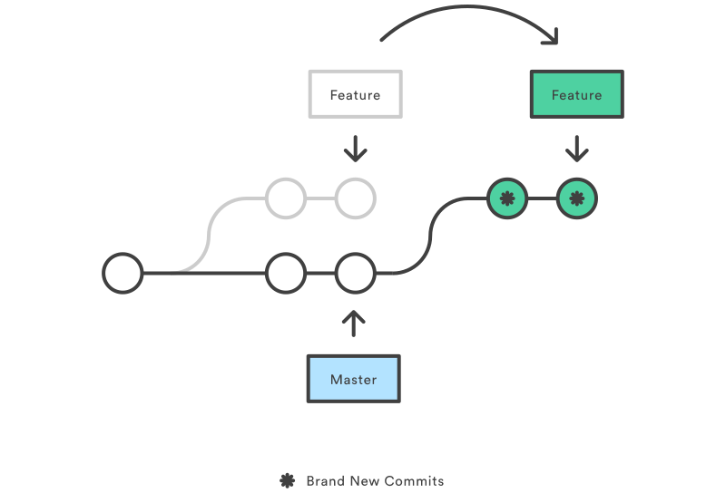

[< back](../README.md)
# GIT 


### Start
- **klonovat** adresar

    `git clone <repo> <adresar>`


- **inicializacia** - nastavenie pracovneho adresara ako git repo

    `git init`

- pridanie lokalneho projektu do prazdneho repa

    ```
    git add .
    git commit -m "first commit"
    git remote add origin <remote repository URL>
    git push -u origin master
    ```
### Get info

- **vetva a zmeny**

    `git status`

- **len zmeny**

    `git status -s`

- **vypis unstagged zmien** (rozdiel oproti poslednemu commitu)

    `git diff`

- *vypis stagged zmien** (rozdiel oproti poslednemu commitu)

    `git diff --staged`

- **historia**

    `git log`

- **graf**

    `git log --oneline --graph --decorate --all -n 20`
-all znamena ze chcem vsetky vetvy

### Ukladanie zmien
- **pridanie zmien do indexu** - stagged changes

    `git add <path>`

- **odobranie z indexu**

    `git reset <path>`

- **commit**

    `git commit -m "message"`

- fast commit

    `git commit -m-a "sprava"` -pred commitom urobi `git add .`

- multi-line commit

    `git commit -m $'daco\nvolaco'`

- pridanie zmien do posledneho commitu

    `git commit --amend --no-edit` -potom force-push

- **push**

    `git push` -na aktualnu vetvu

    `git push origin <vetva>` -na inu vetvu

### Vratenie zmien

- **revert** - zahodi zmeny v ramci commitu, vytvori novy commit, ktorym sa donstanem do stavu pred commitom, potom pushnem do remote

    `git revert <commit>`

- revertovanie starsieho commitu (niekolko commitov dozadu)

    `git revert HEAD~3` - 3 commity dozadu, treba vyriesit konflikty, takto sa zachovaju vsetky dalsie commity

- revertovanie od-do (radsej revertovat po jednom)

    `git revert HEAD~5..HEAD~1`

- **reset** - resetuje aktualny HEAD do urciteho stavu

    `git reset HEAD~` - zahodi zmeny (nezachova stagged changes)

    `git reset --hard HEAD~` - zahodi vsetky necommitnute zmeny

    `git reset --soft HEAD~` - zahodi len unstagged zmeny

- ****

### Nacitanie zmien z commitu
- **cherry pick** - dotiahnutie zmien z akehokolvek commitu (ako copy-paste)
    `git cherry-pick <commit>`


### Nacitanie zmien z remote repo

- **fetch**

    `git fetch` -aktualizuje graf (info o zmenach) ale nesynchronizuje lokalny adresar

- **pull**

    `git pull` -aktualizuje a synchronizuje lokalny adresar (fetch + rebase)

### Vetvy

- **prepnut vetvu**

    `git checkout <vetva>`

- **vytvorit vetvu**

    `git branch <vetva>`

- **vytvorit vetvu a zostat na nej**

    `git checkout -b <vetva>`

- **vypisat aktualnu vetvu**

    `git branch`

- **vypisat vetvy**

    `git branch -a`

- **vymazat lokalnu vetvu**

    `git branch -d <vetva>`

- nutene vymazanie

    `git branch -D <vetva>`

- **vymazat remote vetvu**

    `git push remote --delete <vetva>`

    alebo

    `git push origin :<vetva>`

- **premenovat vetvu** 
    `git branch -m <new-branch-name>`

### Merge


- pridanie zmien z jednej vetvy do druhej
- vetva z ktorej mergujem sa ukonci
- 2 typy merge:
    - **fast forward:** pouzije sa ak existuje priama cesta, presunie hlavnu vetvu tam kde je feature vetva
    - **3-way:** vznikne novy merge commit ktorym sa zlucia dve vetvy

- postup:
    - prepnem sa vetvu do ktorej chcem mergovat
    `git checkout master`
    - spustim merge
    `git merge <moja-feature-vetva>`

### Rebase


- priklad - chcem si rebasnut najnovsieho mastra do feaeture vetvy
    ```
    git checkout master
    git pull
    git checkout feature-branch
    git rebase master
    git pull // urobi novy commit
    git push
    ```

- ak nemam v lokalnom repe najnovsi master dotiahnem si ho alebo mergujem s origin/master

- iny postup
    ```
    git rebase origin/master
    git add . // tymto potvrdim ze som vyriesil konflikty
    git rebase —-continue
    git push —-force
    ```

### Stash

- **odlozenie zmien** bokom

    `git stash`

- **aplikovanie** posledneho stashu

    `git stash apply`


### Alias

vytvori alias prikazu

`git config --global alias.moj_alias 'zastupeny prikaz'`

### Undo commit(s)

ak sa chcem vratit na nejaky commit z historie a zahodit vsetky novsie zmeny v ramci branche

```
git reset --hard 0ad5a7a6
git push -f
```


### Add git to existing project

```bash
git init -b main
git add .
# Adds the files in the local repository and stages them for commit. To unstage a file, use 'git reset HEAD YOUR-FILE'.

git commit -m "First commit"
# Commits the tracked changes and prepares them to be pushed to a remote repository. To remove this commit and modify the file, use 'git reset --soft HEAD~1' and commit and add the file again.

git remote add origin <remote repository URL>
# Sets the new remote

git remote -v
# Verifies the new remote URL

git push -u origin main
# Pushes the changes in your local repository up to the remote repository you specified as the origin
```

### Change remote repository

- check actual remote repo

    `git remote -v`

- change remote repo

    `git remote set-url origin <your repo>`
    
### Revert merge

- creates a new commit that reverts changes from last (merge) commit

    `git revert -m 1 <merge-commit-hash>`

### Rename branch

- go to local branch

    `git checkout <old_name>`

- rename local branch

    `git branch -m <new_name>`

- push new local branch and reset the upstream branch

    `git push origin -u <new_name>`
    
- delete old remote branch

    `git push origin --delete <old_name>`

### Remove file change from any commit

- rebase file to previous commit

    `git checkout <commit-hash> -- <relative-path-to-file>`

- commit changes

    `git commit -m "revert ..."`

- example

    `git checkout a24b2c70c9fa1f3753413d6499f6b93f1286ef22 -- ./CHANGELOG.md`

