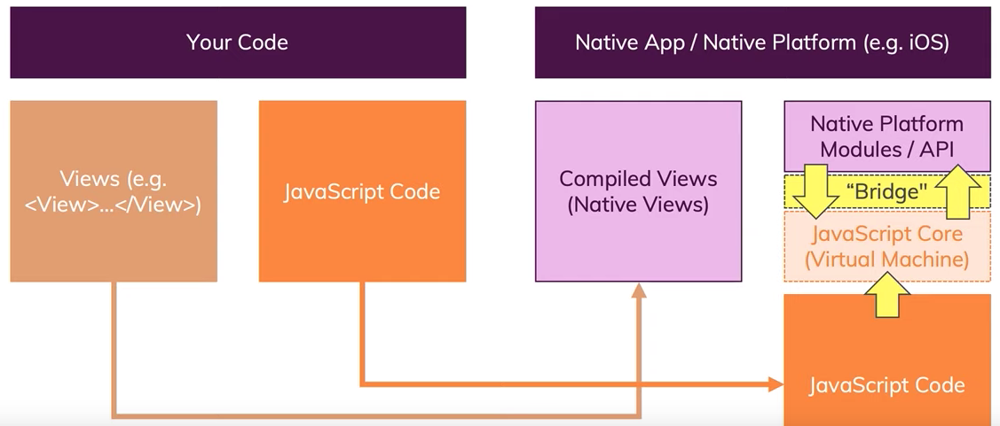
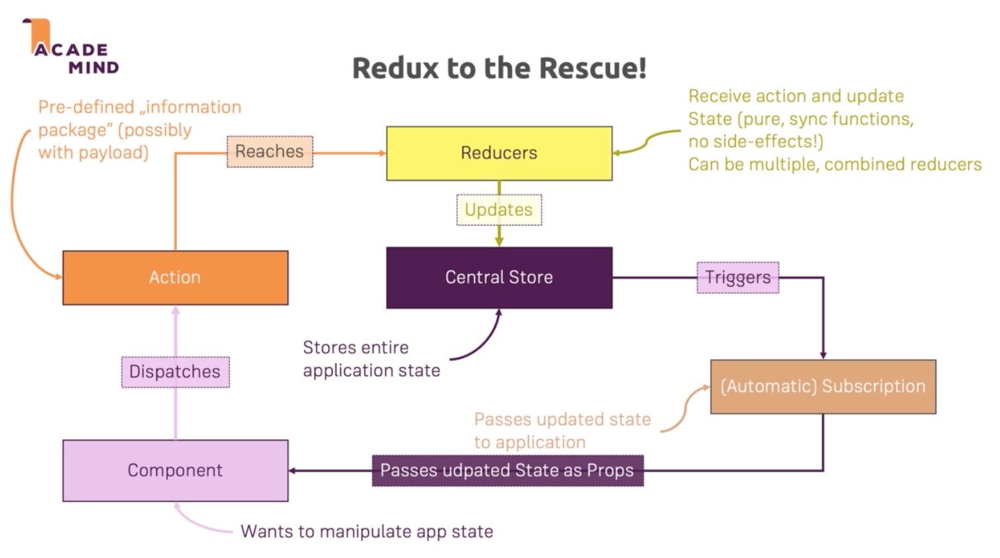

[< back](../README.md)
# REACT NATIVE


[Getting Started](https://facebook.github.io/react-native/docs/getting-started)

### UI 
* Widgety namiesto html komponentov

    `<div>` → `<View>`

    `<input>` → `<TextInput>`

* kompiluje sa do nativnych views

### Logika

* napisana v js → JS vlakno hostovane React Native apkou, nekompiluje sa



### Vytvorenie apky
* expo - 3rd party service, mng development workflow, utility, apka na telefon,   ! obmedzenie expo ekosystemom

    [Expo — Learn how](https://expo.io/learn)

    `expo init <nazov-apky>`

    `npm start`
* react native CLI - full control, plna flexibilita

### debugovanie
- native device via usb or simulator (android studio, Xcode)
- ako? 
	* err msgs
	* console.log()
	* chrome debugger dostupny pre react

#### chrome debugger
iOS - cmd+d
Android - cmd+m
- select **debug js remotly**
(Dalsie cool features - performance monitor, inspector)
- otvori sa stranka debugger-ui
- na nej otvorim konzolu
- zalozka sources
- debugger worker -> tu mozem vidiet svoje zdrojaky, pridavat zarazky, krokovat…
- **!nakoniec debugger stopnem** - v emulatoroch (cmd+d/cmd+m)

#### react native debugger
[react native debugger](https://github.com/jhen0409/react-native-debugger/releases)
cmd+t/ctrl+t → cislo portu → confirm
→potom v emulatore → debug remotly

### Struktura projektu
* **assets/** → fonty, obrazky
* **components/**     
* **constants/** → farby
* **data/** → dummy-data, mocks
* **models/** → DTOs
* **navigation/** → react-navigation
* **screens/** → obrazovky
* **store/** → redux
	* **actions/**
	* **reducers/**

### Komponenty
#### zakladne react-native:
##### View 
- namiesto `<div>`

##### Text 
- mozem v nom zanorovat dalsi text widget, pricom plati dedicnost stylov

    `<Text numberOfLines={2}>Bla bla bla bla bla</Text>`

- ak nastavim number of lines, text sa automaticky skrati keby sa nezmestil
##### Button

    `<Button title="" onPress={} color=""/>`

- neda sa stylovat, ak chcem nastavit sirku, musim zabalit do `<View>`

##### Touchable 
- **TouchableNativeFeedback** -len Android
- property useForeground (prekryje aj obrazky)
- **TouchableHilight**, **TouchableOpacity**, **TouchableWithoutFeedback**)

##### Text input 
```html
<TextInput 
	placeholder="" 
	onChangeText={} 
	value={} 
	keyboardType="numeric"
	autoCapitalize="sentences"
	returnKeyType="next"
	onSubmitEditing={()=>{}}
  multiline
  numberOfLines={3}
/>
```
##### Image
`<Image source={require(‘../assets/congrats.png’)} resizeMode=“contain”>`
- from web `<Image source={{uri:’https://thmb...master.jpg’}} resizeMode=“contain”>` 
	- pre obrazok z webu vzdy nastavit vysku a sirku
-image ma defaultiny fade in effect -fadeDuration property
##### ImageBackground 
- ako normalny img, ale je na pozadi pouzijeme ho napr. vnutri view a obalime nim content
    ```jsx
    <View>
        <ImageBackground source={...}>
            ...content
        <ImageBackground>
    <View>
    ```
##### ScrollView 
- !ANDROID -ak mam tento widget obaleny vo `<View>` , to musi mat nastaveny `flex: 1` v styles

##### FlatList 
- postupne donacitavanie 
-data -> `[{key: “”, value:””},…])` -> item data -> `{index: number, item: {key:"", value: ""}}`

    ```jsx
    <FlatList
        data={DATA}
        renderItem={({ itemData }) => <Item title={itemData.item.title} />}
        keyExtractor={item => item.id}
    />
    ```
- s property `numOfColumns={2}` vytvorim grid layout
##### SectionList 
- ma naviac sekcie
##### Modal 
- vzdy fullscreen

`<Modal visible={false} animationType="none|slide|fade" transparent></Modal>`

##### KeyboardAvoidingView 
- vnutri ScrollView

    `<KeyboardAvoidingView behaviour="position|padding|height" keyboardVerticalOffset={30}></...>`

- na androide funguje najlepsie “padding”, na iOS “position”
##### SafeAreaView 
- aby nezavadzal noch alebo navigacne prvky

`<SafeAreaView>...vsetok obsah</SafeAreaView>`
##### Switch

```jsx
<Switch
	value={isGlutenFree}
	onValueChange={newValue => setIsGlutenFree(newValue)}
	trackColor={{true:Colors.primaryColor}}
	thumbColor={Platform.OS==='android' ? Colors.primaryColor : ''}
/>
```

#### native objekty
##### Keyboard
```js
import {Keyboard} from 'react-native'

Keyboard.dismiss()
```
##### Alert
```jsx
import {Alert} from 'react-native'

Alert.alert(
	'InvalidNumber',
	'Number has to be a number between 1 and 99.',
	[{text:'Okay', style:'destructive', onPress:resetInputHandler}]
)
```

#### z kniznic:
##### react-native-modal 
- pre modalne a dialogove okna aj s animaciou

### Styly
Inline alebo StyleSheet objekty (preferovane)
```jsx
import { StyleSheet, View } from 'react-native'
export default funtion App() {
	return (
		<View style={styles.container}> ... </View>
	)
}

const styles = StyleSheet.create({
	container: {
		padding: 50
	}
})
```
* **margin, padding** - okrem paddingTop… paddingVertical, paddingHorizontal, marginVertical, marginHorizontal
* **shadow** - color, opacity, radius, offset{width: 0, height: 2}  ! android nema shadow ale **elevation**
* ak chcem nastavit niektore styly zvonka 

    `<View style={{…styles.wrapper,…props.style}}>`

#### Fonty
- zlozka assets/fonts
- nacitanie v App.js:
    ```jsx
    import React, {useState} from 'react'
    import * as Font from ’expo-font’
    import { AppLoading } from 'expo'

    const fetchFonts = () => {
        return Font.loadAsync({
            'open-sans':require('./assets/fonts/OpenSans-Regular.ttf'),
            'open-sans-bold':require('./assets/fonts/OpenSans-Bold.ttf')
        })
    }

    export default function App() {
        const [dataLoaded,setDataLoaded] = useState(false)

        if(!dataLoaded){
            return (
                <AppLoading
                    startAsync={fetchFonts}
                    onFinish={() => setDataLoaded(true)}
                    onError={err => console.log(err)}
                />

            )
        }
    ```
- pouzitie:

    `fontFamily: 'moj-nazov-pre-font'`

#### definovanie default syles
- subor ./constants/default-styles.js

    ```js
    import {StyleSheet} from 'react-native'

    export default StyleSheet.create({
        bodyText:({
            fontFamily:'open-sans',
            color:'blue'
        })
    })
    ```
    
    `import DefaultStyles from '../constants/default-styles.js'`
#### Stylovanie listov 
- property `contentContainerStyle={styles...}`

### Flexbox
- ako v css ale defaultne `flexDirection: 'column'`

### Schovanie klavesnice

Napr. Po kliknuti na element, mozem pouzit aj na wrapper celej obrazovky ak ho obalim do TouchableWithoutFeedback
`import { Keyboard } from 'react-native`
`<... onPress={Keyboard.dismiss} />`

### Ikony
`import { Ionicons, MaterialIcons } from '@expo/vector-icons`
pouzitie (inside `<Text>`):
`<Ioniconsname=“md-remove” size={24} color=“white”/>`

### Responzivita
`import {Dimensions} from 'react-native`
`Dimensions.get(‘window|screen’).height|width`
- pocita sa len ked sa apka nacitala, ak otocime zariadenie, neprepocita sa
- prerendrovanie dosiahneme zapojenim stavu
```jsx
const [buttonWidth, setButtonWidth] = useState(Dimensions.get('window').width / 4)

const updateLayout = () => {
	setButtonWidth(Dimensions.get('window').width / 4)
}

Dimensions.addEventListener('change', updateLayout)
```
- alebo useEffect
```jsx
const [availableWidth, setAvailableWidth] = useState(Dimensions.get('window').width / 4)

useEffect(()=>{
	const updateLayout = () => {
		setAvailableWidth(Dimensions.get('window').width / 4)
	}
	Dimensions.addEventListener('change', updateLayout)
	return () => {
		Dimensions.removeEventListener('change', updateLayout)
	}
})
```

### Orientacia 
- povolit orientaciu:

    v app.json
`"orientation":"potrait|landscape|default"`

- zistit/zamknut orientaciu:

    `import { ScreenOrientation } from 'expo'`

    `ScreenOrientation.lockAsync(ScreenOrientation.OrientationLock.PORTRAIT)`

    `ScreenOrientation.getOrientationAsync()`

### Platform API
`import {Platform} from 'react-native`
`... Platform.OS === 'android' ? 'blue' : 'white'`

Best practice:
- v styles definujem vseobecny baseHeader a potom specificke iosHeader a androidHeader
```jsx
<View 
	style={{
		…styles.baseHeader, 
		…Platform.select({ios: iosHeader, android: androidHeader})
	}}
>...
```
**Android ripple effect**
```jsx
let Btn = TouchableOpacity
if (Platform.OS === ‘android’ && Platform.Version >= 21){
	Btn = TouchableNativeFeedback
}
...
<Btn />
```

**Platform-specific komponenty**
- staci za nazov komponentu dopisat .android/.ios
- importujem bez koncovky
- napr.: MainBtn.js → **MainBtn.android.js**, **MainBtn.ios.js** → `import MainBtn from './MainBtn'`

### Navigacia, routing
[React Navigation](https://reactnavigation.org/)
- Pomocou react-navigation - checknut dokumentaciu, obcas sa postup meni, rozdiel je aj ci pouzivam expo alebo react-native-cli

#### Stack navigation
- obrazovky sa vrstvia na seba
1. instalacia

    `npm i react-navigation react-navigation-stack`

    `expo install react-native-gesture-handler react-native-reanimated`

2. ./navigation/MealsNavigation.js
    ```js
    import {createAppContainer} from 'react-navigation'
    import {createStackNavigator} from 'react-navigation-stack'

    import CategoriesScreen from '../screens/CategoriesScreen'
    import CategoryMealsScreen from '../screens/CategoryMealsScreen'
    import MealDetailScreen from '../screens/MealDetailScreen'

    const MealsNavigator = createStackNavigator({
        Categories: CategoriesScreen,
        CategoryMeals: CategoryMealsScreen,
        MealDetail: MealDetailScreen
    })

    export default createAppContainer(MealsNavigator)
    ```

3. ./App.js
    ```jsx
    import MealsNavigator from'./navigation/MealsNavigation'

    export default function App(){
    ...
        return(
            <MealsNavigator/>
        )
    }
    ...
    ```

4. Navigacia
    - navigate, push, pop, popToTop, replace

        `<Button title="GotoMeals!" onPress={() => props.navigation.navigate({ routeName: 'CategoryMeals' })} />`

    - alebo len `props.navigation.navigate('CategoryMeals')` - navigate funguje len routovanie na inu screen
    - alebo `props.navigation.push('CategoryMeals')` - push funguje aj na rovnakej urovni
    - alebo `navigation.replace('CategoryMeals')`- nahradenie v ramci historie, ziadna animacia, neda sa ist naspat

    - Naspat - `navigation.goBack()`  - vsetky typy navigacie, `navigation.pop()` a `navigation.popToTop()` - len stack navigation

    Kazdy komponent ktory sme zaradili do stacku ma specialne props (len high-level komponenty)

    - props funkcie: pop, push, navigate, …

5. Navigation options 
    - napr. nadpis, farba headeru,…
    - definujem mimo komponent 
(alebo lepsie v  `createStackNavigator()` , ako druhy atribut dam `defaultNavigationOptions: {...}`)

    ```jsx
    const MyComponent Screen = props => { ... }

    MyComponent.navigationOptions = {
        headerTitle: 'nadpis',
        headerStyle: {
            backgroundColor: 'farba pozadia'
        },
        headerTintColor: 'farba nadpisu',
        headerTitleStyle: {...}
    }
    ```

    - ak chcem pouzit forwardovane parametre vytvorim funkciu ktora vrati options objekt, parametrom funkcie su nav. data:
    ```jsx
    CategoryMealsScreen.navigationOptions = navigationData => {
        const categoryId = navigationData.navigation.getParam('categoryId')
        const selectedCategory = CATEGORIES.find(c => c.id === categoryId)
        return {
            headerTitle: selectedCategory.title
        }
    }
    ```
    - Rovnako ako **getParam()** existuje aj funkcia **setParams()**, ktora ako parameter berie objekt s parametrami, takto mozem predavat data medzi komponentom a jeho navigationOptions 
    - setParams() sposobi prerendrovanie komponentu pretoze meni props - ak volam setParams() len tak v komponente (vzdy pri jeho vytvoreni), nastane **zacyklenie** - riesenie: setParams() volam vnutri useEffect() hooku ktoremu musime urcit pole premennych na ktorych zmenu reaguje

6. Forwardovanie properties
    ```jsx
    props.navigation.navigate({routeName: ’CategoryMeals’, params: {
        categoryId: itemData.item.id
    }})
    ```
    
    pouzitie:
    `constcategoryId=props.navigation.getParam(‘categoryId’)`

#### Tlacitka v navigation header
1. Vytvorenie komponentu ./components/HeaderIcon.js
```jsx
import React from 'react'
import {HeaderButton} from 'react-navigation-header-buttons'
import {Ionicons} from '@expo/vector-icons'

const HeaderIcon = props => {
	return(
 		<HeaderButton {...props} IconComponent={Ionicons} iconSize={23} color=.../>
	)
}

export default HeaderIcon
```

2. Pouzitie
```jsx
import { HeaderButtons, Item } from 'react-navigation-header-buttons'
import HeaderIcon from '../components/HeaderIcon'
...
const MyComponent = props => {
...
}
MyComponent.navigationOptions = navigationData => {
	return{
		headerTitle: 'Bla bla',
		headerRight: 
			<HeaderButtons HeaderButtonComponent={HeaderIcon}>
				<Item title="Favourite" iconName='ios-star' onPress={()=>{...}}/>
			</HeaderButtons>
	}
}
```

#### Tabs
`import { CreateTabsNavigator } from 'react-navigation-tabs'`
v  ./navigation/MealsNavigation.js, (v ./App.js vratim tento komponent)
```jsx
import { createAppContainer } from 'react-navigation'
import { createBottomTabNavigator } from 'react-navigation-tabs'
import { Ionicons } from '@expo/vector-icons'

import FavoritesScreen from '../screens/FavoritesScreen'

const MealsFavTabNavigation = createBottomTabNavigator (
	{
		Meals: {
			screen: MealsNavigator, // mozem pouzit obrazovku ale aj stack navigator
			navigationOptions: {
				tabBarLabel: 'All' // ak chcem iny nazov
				tabBarIcon: tabInfo => {
					return(
						<Ionicons
							name="ios-restaurant"
							size={25}
							color={tabInfo.tintColor}
						/>
					)
				}
			}
		},
		Favourites: {
			screen: FavoritesScreen,
			...
		}
	},
	{
		tabBarOptions: {
			activeTintColor: 'dsfsdfsd'
		}
	}
)

// exportujem len root navigator
export default createAppContainer( MealsFavTabNavigation )
```
- defaultne sa taby hodia viac do iOS ako do androidu
- pre prisposobenie pre android pomoze npm kniznica  `npm i react-navigation-material-bottom-tabs`  a ta vyzaduje aj `npm i react-native-paper`
- importujem `import {createMaterialBottomTabNavigator} from ’react-navigation-material-bottom-tabs’`
- potom rozlisim navigacny bar podla platformy

    ```js
    const MealsFavTabNavigation = Platform.OS === ‘android’ 
        ? createMaterialBottomTabNavigator(
            ...
            shifting:true
        )
        : createBottomTabNavigator(	
            ...
        )
    ```
- material tab bar ma takmer rovnaky config, naviac ale pekny **shifting** efekt (text sa objavi len pri aktivnom tabe, ak ma bar na roznych obrazovkach rozne farby (navigationOptions → tabBarColor), pekny ripple prechod)  

#### Drawer
`npm i react-navigation-drawer`

- pridanie navigatora (jednotlive polozky mozu byt screeny alebo stack navigatory) + par stylov
```js
import { createDrawerNavigation } from 'react-navigation-drawer'

const MainNavigator = createDrawerNavigator(
	{
		MealsCategories: {
			screen: MealsFavTabNavigator,
			navigationOptions: {
				drawerLabel:'Meals'
			}
		},
		Filters:FiltersNavigator
	},
	{
		contentOptions: {
			activeTintColor:Colors.secondaryColor,
			labelStyle:{
				fontFamily:'open-sans-bold'
			}
		}
	}
)
```

- pridanie menu btn do komponentu
```jsx
import { HeaderButtons, Item } from 'react-navigation-header-buttons'
import HeaderIcon from '../components/HeaderIcon'
...
MojKomponent.navigationOptions = navData => {
	return{
		headerTitle: 'Filter Meals',
		headerLeft: 
			<HeaderButtons HeaderButtonComponent={HeaderIcon}>
				<Item
					title="menu"
					iconName='ios-menu'
					onPress={()=>{navData.navigation.toggleDrawer()}}
				/>
			</HeaderButtons>
	}
}


```
(v navigation existuju dalsie funkcie ako `openDrawer()` a `closeDrawer()`)

##### Ikony v drawer menu
- polozky v menu su vacsinou stack navigators, v kazdom teda mozem definovat jeho ikonu
```jsx
const NejakyStackNavigator = createStackNavigator(
	{
		navigationOptions: {
			drawerIcon: drawerConfig => (
				<Ionicons
					name={Platform.OS === 'android' ? 'md-cart' : 'ios-cart'}
					size={23}
					color={drawerConfig.tintColor}
				/>
			)
		}
	}
)
``` 

#### Dalsie priklady navigation options
```jsx
headerStyle: {
 backgroundColor: 'white'
},
headerTintColor: Colors.primaryColor,
headerTitleStyle: {
	fontFamily:'open-sans-bold'
},
headerBackTitleStyle: {
	fontFamily:'open-sans'
},
tabBarLabel: 
	Platform.OS==='android' 
	? <Text style={{fontFamily:'open-sans-bold'}}>Meals</Text> 
	: 'Meals',
```

### Models
-modely pre data, zapisuju sa ako classes v zlozke **./models**
-priklad:
```js
class Category {
	constructor(id, title, color){
		this.id = id
		this.title = title
		this.color = color
	}
}

export default Category
```

### Redux
`npm i redux react-redux`


zlozky:
- **./store**
    - /actions
	- /reducers

* reducer
```js
const initialState = { ... }

const nejakyReducer = (state = initialState, action) => { 
	switch (action.type) {
		case NEJAKA_AKCIA:
			...
			return { ...state, daco: newDaco }
		default:
			return state
	}
}

export default mealsReducer
```
* action
```js
export const NEJAKA_AKCIA = 'NEJAKA_AKCIA' // kvoli autom. doplnaniu

export const nejakaAkcia = nejakaProp => {
	return { type: NEJAKA_AKCIA, daco: nejakaProp}
}
```
* App.js
```js
import { createStore, combineReducers } from 'redux'
import { Provider } from 'react-redux'
...
const rootReducer = combineReducers({ nejaky: nejakyReducer })
const store = createStore(rootReducer)
...
export default function App() {
	...
	return <Provider store={store}><Komponent /></Provider>
}
```

* vo funkcionalnych komponentoch
```js
import { useSelector, useDispatch } from 'react-redux'
// ina alternativa - mapStateToProps & mapDispatchToProps + connect
import { nejakaAkcia } from '../store/actions/action'

...
const data = useSelector(state => state.blabla.bla)
...
// ak akciu potrebujem v navigation property
const dispatch = useDispatch()

const nejakyHandler = useCallback(() => {
	dispatch(nejakaAkcia(nejakaProp))
},[dispatch, nejakaProp])

useEffect(()=>{
	props.navigation.setParams({mojaFunkcia: nejakyHandler})
}, [nejakyHandler])
```
#### redux devtools extension
`npm install --save-dev redux-devtools-extension`
v App.js
```js
import {composeWithDevtools} from 'redux-devtools-extension' 
...
const store = createStore(rootReducer, composeWithDevtools()) 
// vymazat pred deployom
```

### Prevod datumu
**iOS**
toLocaleDateString (android nepodporuje)
```js
getreadableDate(){
	return this.date.toLocaleDateString('en-EN',{
		year: 'numeric',
		month: 'long',
		day: 'numeric',
		hour: '2-digit',
		minute: '2-digit'
	})
}
```
**Android**
(aj iOS)

`npm i moment`

`import moment from ”moment”`

`moment(this.date).format(‘MMMM Do YYYY, hh:mm’)`

### Form validation
Pridam stav
```js
const [title, setTitle] = useState(editedProduct ? editedProduct.title : '')
const [titleIsValid, setTitleIsValid] = useState(false)
```

Potom validujem v handler funkcii
```js
consttitleChangeHandler=text=>{
	if (text.trim().length === 0) {
		setTitleIsValid(false)
	} else {
		setTitleIsValid(true)
	}
		setTitle(text)
	}
```

Mozem vyuzit **3rd party libraries**:
[validate.js](https://validatejs.org/)

Ak mam viac inputov ja dobre pouzit na spravu stavu reducer z reactu (nie redux)

`import {useReducer} from 'react`