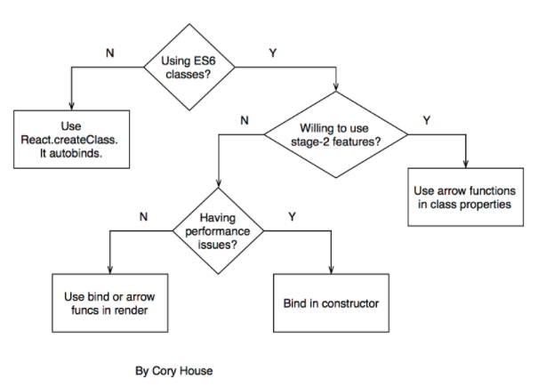
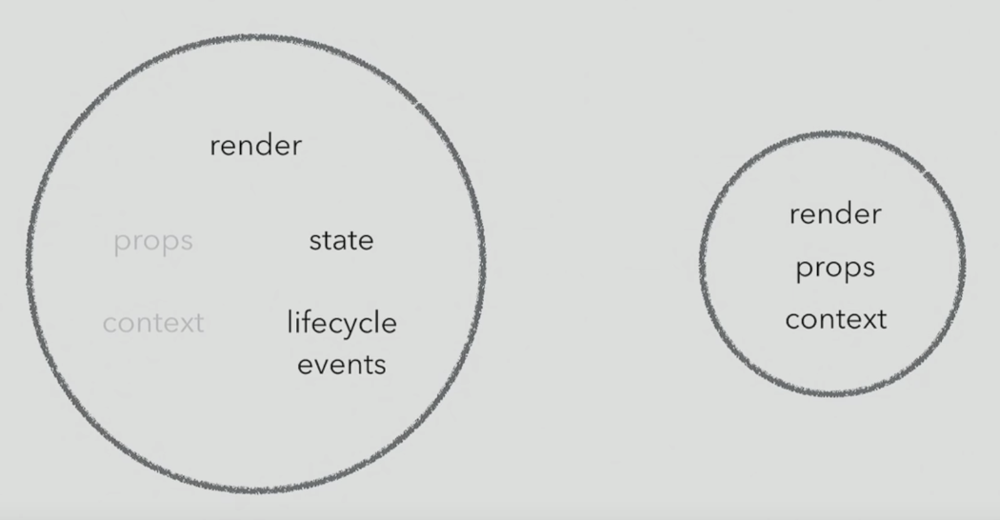

[< back](../README.md)
# React principles

1. [Components](#Components)
            
    - [Class vs Function](#Class_vs_Function)

        - [Class_based_components](#Class_based_components)

            - [Methods](#Methods)

            - [Lifecycle](#Lifecycle)

        - [Functional_components](#Functional_components)

    - [Component Design Patterns](#Component_Design_Patterns)

        - [Container](#Container)

        - [Presentational Component](#Presentational_Component)

        - [Higher-order component](#Higher-order_component)

        - [Component rendering props](#Component_rendering_props)

    - [Pure Components](#Pure_Components)

2. [Recompose](#Recompose)
    - [withState](#withState)
    - [branch+renderComponent](#branch+renderComponent)
    - [lifecycle](#lifecycle)
    - [compose](#compose)
    - [withHandlers (+withState)](#withHandlers(+withState))
3. [Hooks](#Hooks)
    - [useState](#useState)
    - [useEffect](#useEffect)
    - [useContext](#useContext)
    - [useCallback](#useCallback)

## Components

- UI building blocks
- independent, reusable pieces of UI
- can be nested
- input - props, output - React elements
- components -> DOM
### Class_vs_Function
#### Class_based_components
```js
class MyComponent extends React.Component {
    constructor(props) {
        super(props)
        this.state = { greeting: 'Hello world!' }
    }

    render() {
        return <div>{this.state.greeting}</div>
    }
}

```
- js class object
- inherits from Component (from react library)
- properties - `this.props`
- is **stateful**:
    - init state: 
        a) directly inside the class
        ```js
        class App extends React.Component {
            state = { ... }
            ...
        }
        ```
        b) in the constructor
        ```js
        class App extends React.Component {
            constructor(props){
                super(props) // required calling constructor of the parent class
                this.state = { ... }
            }
        }
        ```

    - get state: `this.state` object
    - set state - e.g. *count* value
        ```js
        this.setState({count: 0}) // auto-merged with state object
        ```

        compute from previous state (for example increment a *count* value): 
        ```js
        this.setState((prevState) => ({ count: prevState.count + 1 }))
        ``` 
- children components from parent - `this.props.children`
- atributes - without var/let/const, just name (init value is optional)
##### Methods 
- `method() {}`
- special methods - constructor(), render() + other lifecycle methods (check section bellow) 
- **binding methods:**
    1. use React.createClass: `onChange={this.method(atr1, atr2)}`
        -automatically bind this values, non-standard deprecated approach
    2. in render (bind): `<el onEvent={this.method.bind(this, atr1, atr2)}>` 
        -clear but new function is called every time component re-renders - performance issue
    3. in render (arrow fn): `<el onEvent={(atr1, atr2) => this.method(atr1, atr2)}>`
        -same pros and cons as bind
    4. in constructor: `this.method = this.method.bind(this)`
        -more code but prevents unnecessary calls during re-render
    5. method as arrow fn: `method = (...) => {...}`

        -clear, prevents unnecessary calls
        -transpiled into constructor, won't be in a prototype, can't be called with `super`, slower than bound functions



##### Lifecycle
**creating and removing component from DOM:** 
- `constructor()` - (es6 feature), call super(props), init state, ~~side effects~~
- `componentWillMount()` - ~~side effects~~, deprecated
`render()` - returns JSX, also rendering of children
- `componentDidMount()` - side effects
- `componentWillUnmount()` - removing el from DOM

**update of component's state (triggered from outside):**

- `componentWillRecieveProps(nextProps)` - state & props sync, ~~side effects~~, deprecated
- `shouldComponentUpdate(nextProps, nextState)` - prevent unnecessary update, ~~side effects~~
- `componentWillUpdate(nextProps, nextState)` - state & props sync, ~~side effects~~, deprecated
- `render()`
- `componentDidUpdate()` - side effects, state changes

**update by internal change:**
- `shouldComponentUpdate(nextProps, nextState)`
- `componentWillUpdate(nextProps, nextState)` - deprecated
- `render()`
- `componentDidUpdate()`

**new (16.3+):**
- `getDerivedStateFromProps(nextProps, prevState)` - after comp is created or recieving a new prop, alternative to componentWillRecieveProps
- `getSnapshotBeforeUpdate(prevProps, prevState) `- called as soon as DOM is updated, f.e. reiszing of window

*deprecated lifecycle methods can be used with `UNSAFE_` prefix

#### Functional_components
or SFC = Stateless functional component
- js function, taking props as an atribute and return JSX elements
- is **stateless** and without lifecycle methods (can be implemented by using HOC, recompose or hooks) 
- no this keyword, components from parent - `props.children`
- less code, easier to read or test

Best practice -> use functional comopnent as often as possible

```js
const MyComponent = props => {
    ...
    return <div>Hello world</div>
}
```

### Component_Design_Patterns


Picture above nicely represents React component types ([by Michael Chan](https://www.youtube.com/watch?v=YaZg8wg39QQ))

The first  two circles represents stateful vs stateless component



#### Container


- fetches the data, does some calculations
- manages state
- renders subcomponents
- pass data and callbacks down to its children components via props 

- implemented as both class-based or functional component (as function needs some magic like hooks, etc.)

Common use case is to use Container as root component for some feature which require to manage some state or data fetching and it renders children components representing presentational layer.

#### Presentational_component


- receive data and callbacks from parent component/container
- functional component
- good reusability

Common use case - for smaller reusable UI pieces, that don't need to manage the state or fetch the data from db,... just return some JSX.

By using containers and presentational component we can split/encapsulate logic and presentation (best practice) 

#### Higher-order_component


- function that takes a component and returns a new component (adds some features to component)

- can return both function or class

- great for sharing or reusing component logic

- using:

    - `const EnhancedComponent = higherOrderComponent(WrappedComponent)`

    - usual way is to use HOC during export of component 

        `export default higherOrderComponent(WrappedComponent)`

    - function that returns HOC

        `export default HOCFunction(atr1, atr2)(WrappedComponent)`

- often part of 3rd party libraries, e.g.

    `withRouter()` from *react-router* → pass updated match, location and history props during render

    `connect(mapStateToProps, mapDispatchToProps)()` from *react-redux* → connects component with redux dispatch and state via props

- using more HOCs - HOC can be nested into another HOC

    `withRouter(withRef(WrappedComponent))`

    better use `compose()` function, can be imported from many libs, e.g. redux
    ```js
    const enhance = compose(hoc1, hoc2 hoc3, ...)
    export default enhance(WrappedComponent)
    ```


- example (HOC adds class to wrapped component): 
    ```jsx
    const withClass = (WrappedComponent, className) => {
        return (props) => (
            <div className={className}>
                <WrappedComponent {...props} />
            </div>
        )
    }

    export default withClass
    ```

#### Component_rendering_props


- also known as rendering callbacks
- sharing code between components using render prop whose value is a function, which returns an element
- reduces namespace collision, better explanation of where the logic comes from

example (simple counter):
```js
class Counter extends React.Component {
    constructor(props) {
        super(props)
        this.state = {
            count: 0
        }
    }

    increment = () => {
        this.setState(prevState => {
            return {
                count: prevState.count + 1
            }
        })
    }

    render() {
        return (
            <div onClick={this.increment}>
                {this.props.children(this.state)}
            </div>
        )
    }
}

class App extends React.Component {
    render() {
        return (
            <Counter>
                {state => (
                    <div>
                        <h1>The count is: {state.count}</h1>
                    </div>
                )}
            </Counter>
        )
    }
}
```
You can see that Counter component expects children props, but this time it is called as a function with a state as an atribute. So we can pass render function to the Counter as a children from its parent - App component.

Now we can use Counter in different components, with the same logic but with different appearance (render method).


### Pure_Components

- from react library
- implements shouldComponentUpdate() with shallow prop and state comparsion - auto-detects when a component should be  updated to avoid unnecessary renders - boosts performance
- class: `class MyComponent extends React.PureComponent { ... }`

! not use everywhere
! only shallow comparsion of objects, don't use in components with complex data structures, it may produce 'false-negatives' (or use `forceUpdate()` everywhere these data structures should be updated)

## Recompose

- older approach (compared to hooks)
- 3rd party lib, set of functions and HOCs 
- common use case - using state and lifecycle methods in functional components
- examples below:
### withState
- HOC, adds state to functional component (alternative to useState hook)
```js
import {withState} from 'recompose'
...
const MyComponent = ({open, setOpen, ...}) => {...}
...
export default withState(‘open’, ‘setOpen’, true)(MyComponent)
```
### branch+renderComponent
- for conditional rendering
```js
import {branch, renderComponent} from 'recompose'
...
export default branch(
	props => props.items.length === 0, //any condition
	renderComponent(Spinner)
)(MyComponent)
```
### lifecycle
- brings lifecycle methods to functional components
```js
import {lifecycle} from 'recompose'
...
export default lifecycle({
	componentDidMount(){
		this.props.myFunction()
	}
})(MyComponent)  
```
### compose
- combines more HOC functions
```js
import {compose} from 'recompose'
...
const enhance = compose(
	hocFunction1(...),
	hocFunction2(...)
) 
export default enhance(MyComponent)
```
### withHandlers(+withState)
-to prevent binding handler function (`<... onClick={()=>HandlerFunkcia()}`) in JSX, because this fn is called every time when component is re-rendered, use withHandlers instead
```js
import {withHandlers, compose, withState} from 'recompose'
...
const MyComponent = ({open, handleClick, ... }) => {
	...
		<... onClick={handleClick}/>
	...
}
...
const enhance = compose(
	withState('open','setOpen', true),
	withHandlers({
		handleClick: props => event => props.setOpen(!props.open)
	})
)
export default enhance(MyComponent)
```

## Hooks

- react 16.8+
- brings state, lifecycle methods and other React features to functional components
- by using we can use functional components only → we can avoid conversion to class-based component
- allows us to reuse stateful logic without changing our component hierarchy
- let us split components into smaller functions based on what pieces are related (such as setting up a subscription or fetching data)
- custom hooks - [see docs](https://reactjs.org/docs/hooks-custom.html)


mostly used hooks:

### useState
- `import { useState } from 'react'`
- function with initialState as an argument which returns array with 2 items - _1. current state_, _2. state setter function_

    `const inputState = useState('')` 
    
    `inputState[0]` - state
    
    `inputState[1]` - state setter function (new state as argument)

- example (set state in input change event handler):
    ```js
    const inputChangeHandler = event => {
        inputState[1](event.target.value)
    }
    ```

- best practice - **destructurive assignment** 

    `const [todoName, setTodoName] = useState('')`


- ! rule for all hooks - hooks can be used in top-level component function only (don't use it in other functions inside component or even in if-else statement or in for cycle)

example (todo list):
```js
import React, { useState } from 'react'

const todo = props => {
 const [todoName, setTodoName] = useState('')
 
 const [todoList, setTodoList] = useState([])

 const inputChangeHandler = event => {
  setTodoName(event.target.value)
 }

 const todoAddHandler = () => {
  setTodoList(todoList.concat(todoName))
 }

 return (
  <>
   <input
    type=“text”
    placeholder=“Todo”
    onChange={inputChangeHandler}
    value={todoName}
   />
   <button type=“button” onClick={todoAddHandler}>
    Add
   </button>
   <ul>
    {todoList.map((todo,i) => (
     <li key={I}>{todo}</li>
    ))}
   </ul>
   <p>aaa</p>
  </>
 )
}

export default todo
```
In the example above there are two use state hooks, it could be merged into single state object - example below
(this practice is not optimal)

```js
const [todoState, setTodoState] = useState({
  userInput: ‘’,
  todoList: []
})

const inputChangeHandler = event => {
  setTodoState({
    userInput: event.target.value,
    todoList: todoState.todoList
  })
}

const todoAddHandler = () => {
  setTodoState({
    userInput: todoState.userInput,
    todoList: todoState.todoList.concat(todoState.userInput)
  })
}
```

### useEffect
- perform side effects in function components
- with this hook we can watch variables, whose changes cause some effect 
- similar to componentDidMount, componentDidUpdate, and componentWillUnmount combined in class-based component

- **2 parameters**:
	1. **Function** which should be called after variables change (first time called when component is mounted)
	2. **Array of variables**, whose change should cause effect 
    (with empty array `[]` it behaves as componentDidMount)

example (counter):
```js
import React, { useState, useEffect } from 'react'

function Example() {
  const [count, setCount] = useState(0)

  // Similar to componentDidMount and componentDidUpdate
  useEffect(() => {
    document.title = `You clicked ${count} times`
  })

  // Similar to componentDidMount
  // Different than componentDidUpdate - called only when count is changed
  useEffect(() => {
    document.title = `You clicked ${count} times`
  }, [count])

  return (
    <div>
      <p>You clicked {count} times</p>
      <button onClick={() => setCount(count + 1)}>
        Click me
      </button>
    </div>
  )
}
```

### others
- useContex
- useCallback
- useReducer
- useMemo
- useRef
...

check [official documentation](https://reactjs.org/docs/hooks-reference.html)
